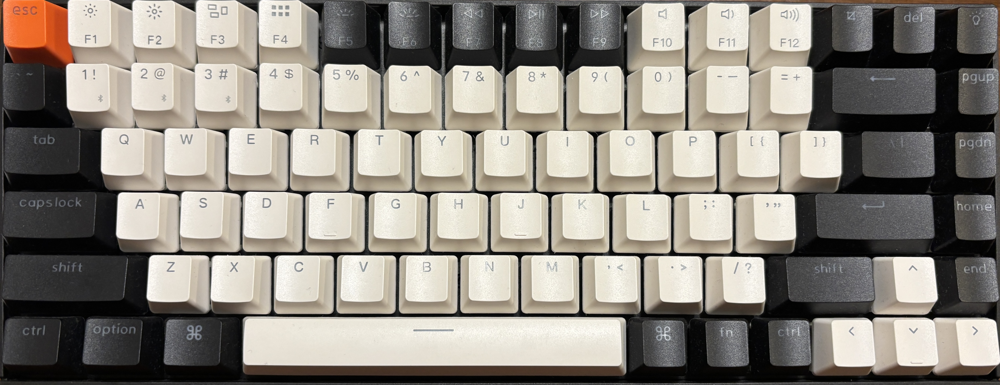

# キーボード設定ドキュメント

## 1. キーボード基本情報

| 項目番号 | 項目名           | 内容例                                                                 |
|----------|------------------|------------------------------------------------------------------------|
| 1-1      | キーボード名     | [KeyChronK2(K2-A1H)](https://keychron.co.jp/products/keychron-k2-hot-swappable-wireless-mechanical-keyboard?srsltid=AfmBOopIpjfbIjW7kbWsKDsBB6_-tyz6EtToQMatkR33Lgv1fKKZAk7q) |
| 1-2      | レイアウト       | 75% |
| 1-3      | 接続方式         | 有線(type-c), Bluetooth |
| 1-4      | 使用ファームウェア | Karabiner(Mac) / AutoHotKey(Windows) |

---
## 2. 設定内容
### 元のキーキャップの並び
75％キーボードで、最初は下記のようなレイアウトのキーボードである。

    

### キースイッチの並び
元のキースイッチから、下記該当箇所は各種キースイッチに入れ替えた。
なお、番号は[使用したキースイッチ一覧](#3-使用したキースイッチ一覧)に対応している。

    

### キーキャップの並び替え

    

---
## 3. 使用したキースイッチ一覧

| No. | メーカー / シリーズ                                           | 種別 / 作動荷重      | メモ | 画像（小さめサムネイル）                                     |
|-----|--------------------------------------------------------------|----------------------|------|--------------------------------------------------------------|
| 1   | Gateron / Smoothie Switch Set                                | Linear / 40±10gf|      |           |
| 2   | Durock / Full POK Mocha Series 2025 - Mocha Silk Linear      | Linear / 48g|      |  |
| 3   | Gateron / Oil King (V2) Linear Switches                      | Linear / 不明|      |  |
| 4   | WS / Pearl Switch                                            | Linear / 不明|      |                  |
| 5   | 80Retros X HMX / Joker switch                                | Linear / 40±10gf|      |                  |
| 6   | Gateron / Mini i Switch                                      | Tactile / 50+10gf|      |                 |
| 7   | TTC / Frozen Silent V2 Switch                                | Silent Linear / 39gf|      |       |
| 8   | Kailh / Midnight Silent V2 Switch                            | Silent Linear / 40±10gf|      |     |
| 9   | Kailh / Yushakobo Fairy Silent Linear Switch                 | Silent Linear / 35±10gf|      |    |
| 10  | Durock / Silent Linear Dolphin                               | Silent Linear / 62gf|      |         |
| 11  | Kailh / Deep Sea Silent Pro Box Switch                       | Silent Linear / 45±10 gf|      |  |
| 12  | Outemu / Lemon Switch V3 Silent Tactile                      | Silent Tactile / 35 ± 10 gf|      |  |
| 13  | TTC / Bluish White Silent Switch                             | Silent Tactile / 42±10gf|      |    |
| 14  | Durock / T1 Shrimp                                           | Silent Tactile / 不明|      |                     |