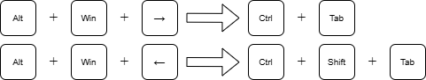
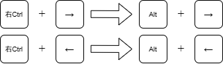

# AutoHotkey（keymap）設定ドキュメント

---
- [AutoHotkey（keymap）設定ドキュメント](#autohotkeykeymap設定ドキュメント)
  - [keymapを用いていること](#keymapを用いていること)
  - [keymapのインストール方法と編集方法](#keymapのインストール方法と編集方法)
    - [インストール](#インストール)
    - [keymapファイルの作成・編集](#keymapファイルの作成編集)
  - [モード切り替え（モードA / モードB）について](#モード切り替えモードa--モードbについて)
  - [キーの変更項目（①〜⑦）](#キーの変更項目)
    - [モードAで有効なキー変更](#モードaで有効なキー変更)
    - [常時有効なキー変更（モード非依存）](#常時有効なキー変更モード非依存)
    - [モードBでのみ有効なキー変更](#モードbでのみ有効なキー変更)

## keymapを用いていること

本設定では、Windows上でキー入力を柔軟に制御するため  
**AutoHotkey（AHK）** を用いてキーマップを実装している。

PowerToysでは実現できない  

- キー割り当ての連鎖制御  
- 条件付き（アプリ限定）動作  
- 使用状況に応じたモード切り替え  

を目的として、AHKを採用している。

本キーマップでは  
**キーボードの使用状況に応じて切り替えるための「モードA / モードB」**  
という概念を導入している。

---

## keymapのインストール方法と編集方法

### インストール
1. https://www.autohotkey.com/ にアクセス
2. **AutoHotkey v1.1（LTS / Legacy）** をダウンロード
3. インストーラを実行し **Express Installation** を選択

### keymapファイルの作成・編集
1. 任意の場所（例：デスクトップ）に `keymap.ahk` を作成
2. 右クリック → **編集** で内容を編集
3. 保存後、`keymap.ahk` をダブルクリックで有効化
4. 変更時はタスクトレイの **緑のHアイコン → Reload Script**

---

## モード切り替え（モードA / モードB）について

①〜③（および⑦）の挙動は  
`Ctrl` + `Alt` + `O` により **モードA / モードB** を切り替えて制御している。

- **モードA**
  - ① `Esc` →`` ` ``
  - ② `Home` →`` ` ``
  - ③ `End` → `Esc`
  - ⑦ は無効

- **モードB**
  - ①〜③ は通常のキー動作
  - ⑦ `Ctrl` + `Esc` → `` ` ``

モード切り替え時には、  
現在のモード（`モードA` / `モードB`）がポップアップ表示される。

---
## キーの変更項目（①〜⑦）

### モードAで有効なキー変更

① `Esc` → `` ` ``（バッククォート）  

② `Home`（通常のHomeキー） → `` ` ``（バッククォート）  

③ `End` → `Esc`（本来のEsc、連鎖なし）  

※ ①〜③ は **モードAのときのみ有効**

---

### 常時有効なキー変更（モード非依存）

④ `` ` ``（物理キー） → `IME ON / OFF` 切り替え  

⑤ Chrome タブ移動（Mac風）  

⑥ Chrome ページ移動（右Ctrl限定）  

---

### モードBでのみ有効なキー変更

⑦ `Ctrl` + `Esc` → `` ` ``（バッククォート）

- **モードBのときのみ有効**
- モードAでは通常の `Ctrl` + `Esc`（スタートメニュー）動作を維持