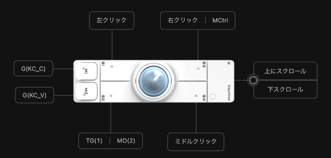
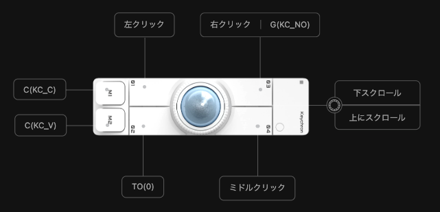
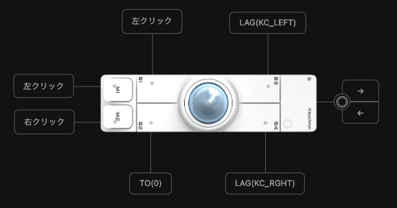
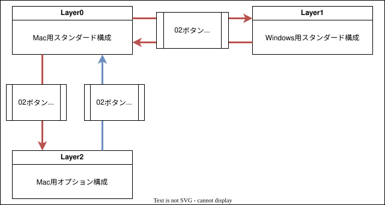

# Nape Pro
## レイヤー設定メモ
### レイヤー0

|||
|-|-|
|最終更新日|2026/07/30|
|概要|Mac OS用の構成。 レイヤー1と行き来することができる。|

|ボタン|短推し|長押し|ホールド|
|---|---|---|---|
|01|左クリック|-|-|
|02|レイヤー1へ|-|レイヤー2へ|
|03|左クリック|Mission Control|-|
|04|ミドルクリック|-|-|
|M1|Cmd + C|-|-|
|M2|Cmd + V|-|-|
|ダイヤル左|上スクロール|-|-|
|ダイヤル右|下スクロール|-|-|

---

### レイヤー1
最終更新日：2026/07/30
|||
|-|-|
|最終更新日|2026/07/30|
|概要|Windows用の構成。 レイヤー2と行き来することができる。|

|ボタン|短推し|長押し|ホールド|
|---|---|---|---|
|01|左クリック|-|-|
|02|レイヤー0へ|-|-|
|03|左クリック|Winキー|-|
|04|ミドルクリック|-|-|
|M1|Ctrl + C|-|-|
|M2|Ctrl + V|-|-|
|ダイヤル左|下スクロール|-|-|
|ダイヤル右|上スクロール|-|-|

---

### レイヤー2
|||
|-|-|
|最終更新日|2026/07/30|
|概要|Mac OS用のスピンオフ構成。 レイヤー0利用時に02キーを長押しすることでこのレイヤーを使用できる。|

|ボタン|短推し|長押し|ホールド|
|---|---|---|---|
|01|左クリック|-|-|
|02|レイヤー0へ|-|-|
|03|Opt + Cmd + ←|-|-|
|04|Opt + Cmd + →|-|-|
|M1|左クリック|-|-|
|M2|右クリック|-|-|
|ダイヤル左|←|-|-|
|ダイヤル右|→|-|-|

---

### 切り替え図

|選択レイヤー|動作|結果|
|---|---|---|
|レイヤー0|02キーを短押しする|レイヤー1へ切り替わる|
|レイヤー1|02キーを短押しする|レイヤー0へ切り替わる|
|レイヤー0|02キーを押しっぱなしにする|レイヤー2へ切り替わる|
|レイヤー2|02キーを押しっぱなしにする|レイヤー1へ切り替わる|